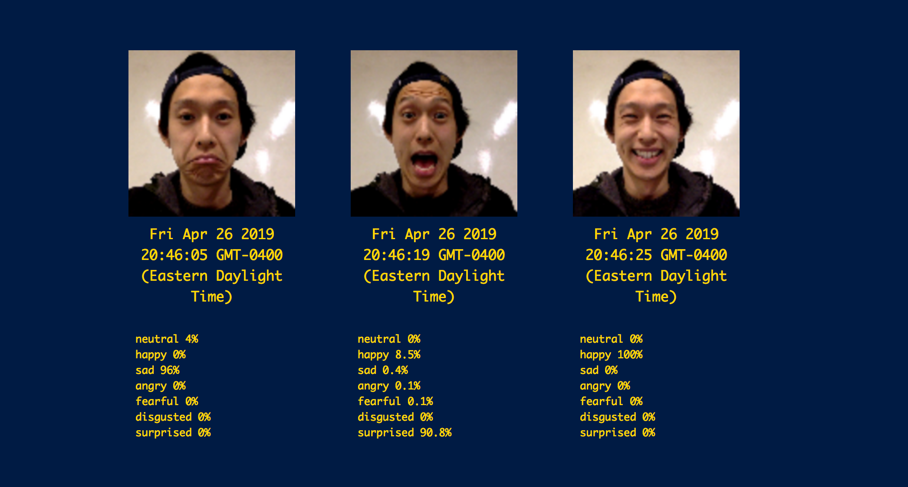

# Data Selfie App - with face expression analysis using face-api.js
> Here I am is a little web application that allows you to submit an image of your self along with your geolocation. This app is a nice starting point for other self-tracking applications or just a standalone application to create a collection of "dataselfies" with some extra metadata.

(NOTE: face expression analysis has its biases based on it's training data. Machines can only learn from what they've been given!)




## Setup

In your terminal:
```sh
npm install
```

then start your server
```sh
npm start
```
or if in development: `npm run dev`

Go to: `localhost:3030` to see the magic.

## Features (coming soon)

- [ ] HTTPS support
- [ ] Authentication and login
- [ ] querying other APIs (e.g. weather)


## Gallery
> Prepared for: Quant Humanists 2019
